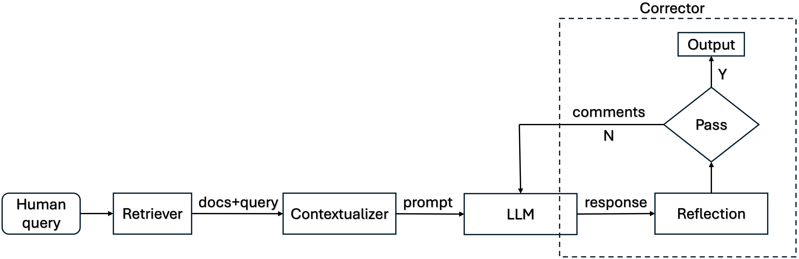

# Medical QA RAG System (updating)
This repository contains a medical question-answering system that utilizes Retrieval-Augmented Generation (RAG). The system is build by PyTorch and Hugging Face from scratch. It is designed to answer medical questions by retrieving relevant documents from a corpus consists of textbooks used in ([MedQA](https://github.com/jind11/MedQA)). Finally, the system can be deployed on AWS using Docker and SageMaker. 

The current LLM used here is `mistralai/Mistral-7B-Instruct-v0.2`, which is a 7B parameter instruction-tuned model and the current corpus is for testing only. The final corpus will be a collection of medical documents, including PubMed articles, clinical guidelines, and other relevant resources. The system is designed to be extensible and can be easily adapted to different domains or datasets.

## Log
[05/08/2025 update]: Finished the training scripts of LoRa and RAG pipeline.

[05/09/2025 update]: Debugged the training scripts and the RAG pipeline v1. The system is now fully functional.

[05/10/2025 update]: Finished the training scripts of LoRa+PPO. Finished the preparation of the deployment scripts except `predictor.py`. 

[05/12/2025 update]: Preprocessed PubMedQA for knowledge base. Changed the retriever from BM25 to FAISS+BioBERT. 

[05/13/2025 update]: Changed model to `mistralai/Mistral-7B-Instruct-v0.2` for generator and re-preprocessed data (adding tags) for fine-tuning.

[05/17/2025 update]: Preprocessed textbooks for knowledge base using semantic split with overlap.

[05/19/2025 update]: Finished the RAG pipeline v2. run `demo.py` for demo.

[05/20/2025 update]: Finished the evaluation script for the RAG pipeline v2. The current acc. on MedQA is 0.39 (corpus: textbooks, LLM: `mistralai/Mistral-7B-Instruct-v0.2`)

[05/22/2025 update]: Finished `ranker` and `problem parser` for retriever. 

[05/23/2025 update]: Finished single-round correction. The current acc. on MedQA is 0.41 (corpus: textbooks, LLM: `mistralai/Mistral-7B-Instruct-v0.2`)

[05/25/2025 update]: Changed the retriever to FAISS+MedCPT+Ranker. The current acc. on MedQA is 0.42 (corpus: textbooks, LLM: `mistralai/Mistral-7B-Instruct-v0.2`)

[Next]: Working on multi-round self-correction loop. Will add plan-and-execution framework and tool use in the future. 

## Current Agent Pipeline 
1. Retriever Model: FAISS+MedCPT+Ranker
   - FAISS is used for efficient similarity search in the corpus.
   - MedCPT is used to encode the medical questions and documents.
   - Ranker (optional) is used to re-rank the retrieved documents.
2. Contextualizer: Used to build LLM prompt 
3. Generator: LLM
   - Currently, `mistralai/Mistral-7B-Instruct-v0.2` (optional fine-tuning and PPO alignment available) is used for testing.
   - It will be replaced with LLM API in the future.  
4. Corrector Model (optional elf-reflection): Used to criticize the generated answer and provide feedback for revision.

## Fine-tuning
The generator model could be fine-tuned using LoRa and PPO for alignment. The configuration files for both methods are provided in the `configs` directory. The fine-tuning process is performed using the Hugging Face Trainer API (LoRa) and customized training loops (LoRa+PPO) on HPC (Slurm job schedular) with Nvidia-A100@80GB. The training scripts are located in the `scripts` directory. The fine-tuned models are saved in the `saved_models` directory (not uploaded).

## Deployment
The system can be deployed on AWS using Docker and SageMaker. The deployment scripts and configuration files are located in the `deployment` directory. The Dockerfile is used to create a container image for the application, which can be deployed on AWS SageMaker. 

More details will be provided in the near future.

